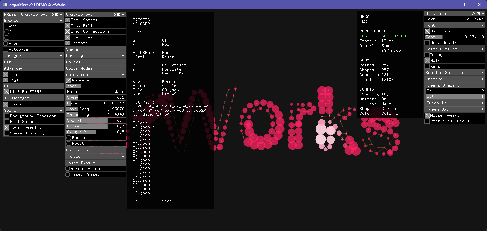
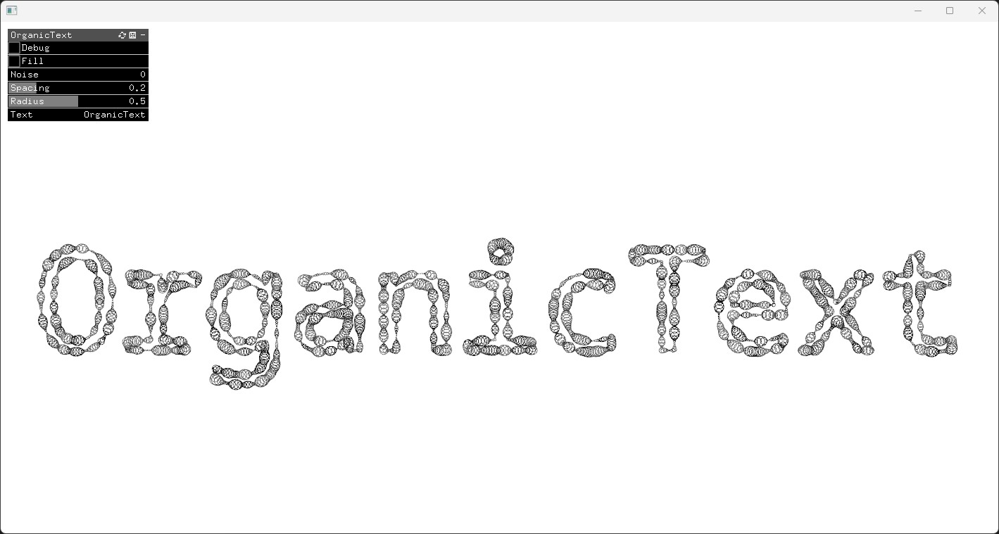

# TextTypoOrganic02

> [!NOTE]  
> **WIP / EXPERIMENTAL**  
>  
> **AI-Assisted Development Project** - This project serves as a real-world test case for AI coding assistants (_GitHub Copilot, Cline, Gemini, etc..._) workflows and documentation patterns. Built upon an original sketch from [colormotor](https://github.com/colormotor).

An **openFrameworks** (aka OF) desktop application that creates organic, animated visualizations from text using customizable shapes, colors, animations, presets and mouse interactions.

*Enhanced version based on original code from [PFAD/examples/week_5/organicTypographyWorked](https://github.com/colormotor/PFAD/tree/main/examples/week_5/organicTypographyWorked)*:

## ✨ For Users

**New to TextTypoOrganic02 ?** → Start with [docs/User/QUICK-START.md](docs/User/QUICK-START.md) for an app usage introduction

## 🤖 For AI Assistants & Coding Agents

**Are you an AI Assistant Agent ?** → Read and deep think into **[AI-AGENTS-GUIDE.md](AI-AGENTS-GUIDE.md)**  
(Feel free to explore also the [docs/AI-Assistant](docs/AI-Assistant) folder.)

## 👨‍💻 For Developers

**[docs/Developer](docs/Developer)** → Folder with developer notes, ideas, future roadmap, evaluating ideas, strategies and priorities, and C++ concepts

### Dependencies
- [ofxSurfingPresetsLite](https://github.com/moebiussurfing/ofxSurfingPresetsLite)
- [ofxSurfingHelpersLite](https://github.com/moebiussurfing/ofxSurfingHelpersLite)
- [ofxTweenLite](https://github.com/moebiussurfing/ofxTweenLite)
- **ofxGui** (OF Core)

## 📋 Project Management

### Changelog

**[docs/CHANGELOG.md](docs/CHANGELOG.md)** → Project history, major milestones and current ptoject status

### File Structure

[FILE-STRUCTURE.md](FILE-STRUCTURE.md)  

## 💻 Tested Systems

- **Windows 11** (openFrameworks 0.12.1, Visual Studio / VS Code)
- **macOS Tahoe** (openFrameworks 0.12.1, Xcode / VS Code)
- **iOS** (openFrameworks 0.12.1+, Xcode / iPad 10th) [_WIP: requires UI bigger scaling_]
- **Emscripten** (openFrameworks 0.12.1+, macOS) [_Not working yet..._]

*Built with openFrameworks C++ - Creative Coding Toolkit*
